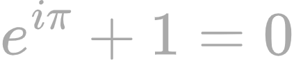

  <a align="center" href="">
    <!-- "https://latex.codecogs.com/svg.image?\huge%20\sin^2(x)+\cos^2(x)=1" -->
    
    <!--img src="https://quicklatex.com/cache3/16/ql_4475b6ee4e6e79901721867310ae1e16_l3.png" title="training of a neural network, based on the GD algorithm." /-->
  </a>

